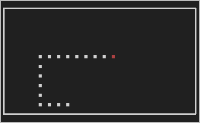

# A simple snake game written in rust



## Installation
Using cargo:
```shell
# cargo install --git https://github.com/fimmind/snake --root ~/.local
```

## Usage

```shell
# snake --help
snake 0.1.0
fimmind <fimmind@mail.ru>
A simple snake game. You can use both arrows and vim-like keys

USAGE:
    snake [OPTIONS]

FLAGS:
        --help    Prints help information

OPTIONS:
    -h, --height <N>    Field's height (cells) [default: 10]
    -w, --width <N>     Field's width (cells) [default: 20]
    -d, --delay <N>     Step delay (miliseconds) [default: 285]
```

### Game controls
| Key                | Action     |
|--------------------|------------|
| `a` `h` `←`        | Move left  |
| `s` `j` `↓`        | Move down  |
| `w` `k` `↑`        | Move up    |
| `d` `l` `→`        | Move right |
| `Space` `p`        | Pause      |
| `q` `Esc` `Ctrl-C` | Quit       |
